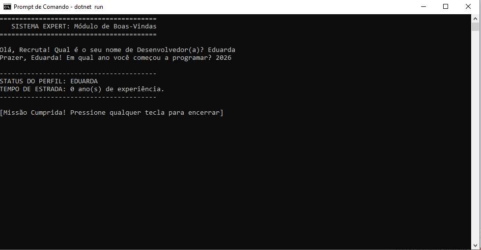

## 🛠️ Comandos de Construção Utilizados

- `dotnet new console`: Para criar a estrutura base do C#.
- `dotnet build`: Para transformar o meu código em algo que o PC entende.
- `dotnet run`: Para ver a mágica acontecer.

## 📦 Estrutura Gerada

Arquivos que o .NET criou para mim:
1. `Program.cs`: Onde fica o código fonte da aplicação.
2. `SistemaExpert.csproj`: O ficheiro de configuração do projeto que gere dependências e versões.

## 📸 Evidência de Execução

Aqui está o registo do sistema a funcionar após a compilação:

